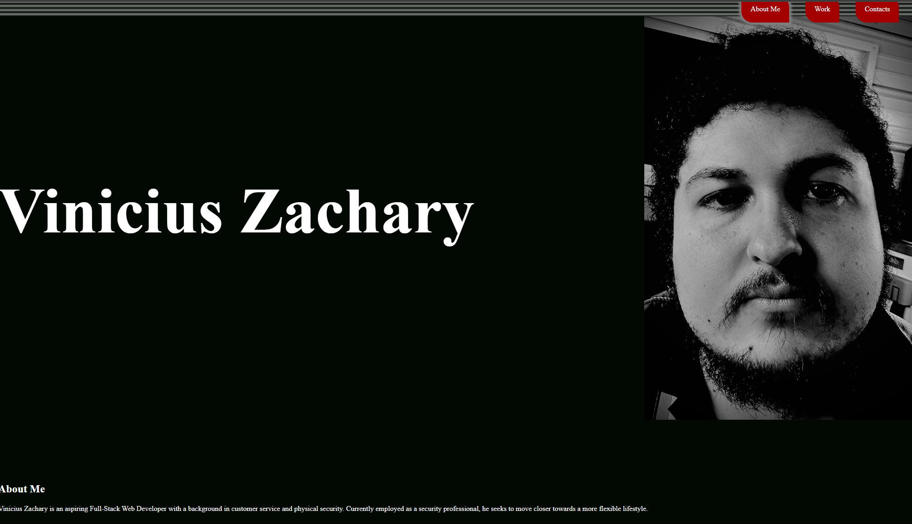

# Weekly Challenge 02: Electric Boogaloo

## Description

Welcome to my professional portfolio! This was created as a way to organize all the information an employer might need or want from a potential employee. It also provides a convenient platform to list and showcase deployed projects. I learned a lot about flex-box and about design in general. my mind was the only thing hurt in the making of this webpage

## Usage

Webpage has several links. if something seems like it should be a link it probably is. 
-navigation bar at the top follows you up and down the page for easy access 
-buttons on navigation bar allow quick access to the section you want to see 
-project images are also links to the deployed project 
-names of popular platforms are links to my profile on those platforms 

## License

MIT License

## How to Contribute

Contributions are not being accepted at this time.
